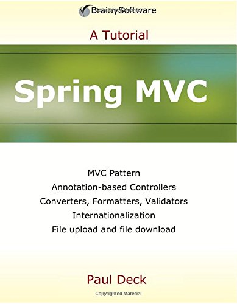

# 《Spring MVC学习指南》实践
---


英文：Spring MVC: a Tutorial Series




利用两条时间把这边书过了一遍，系统讲Spring MVC的书不多，该书比较简单清晰，看完之后至少知道该如何下手，但是深度方面需要自己的积淀。

内容包括：

```xml
<modules>
        <!--Spring依赖注入入门-->
        <module>chapter01</module>
        <!--简单Servlet处理逻辑-->
        <module>chapter02a</module>
        <!--解耦,引入DispatcherServlet-->
        <module>chapter02b</module>
        <!--Validator的引入-->
        <module>chapter02c</module>
        <!--第一个Spring MVC应用-->
        <module>chapter03a</module>
        <!--使用view resolver-->
        <module>chapter03b</module>
        <!--使用RequestMapper和Controller注解-->
        <module>chapter04a</module>
        <!--使用Autowired和Service注解进行依赖注入-->
        <module>chapter04b</module>
        <!--使用Spring表单,数据绑定-->
        <module>chapter05</module>
        <!--Converter, Formatter使用-->
        <module>chapter06a</module>
        <!--Formatter专用于把String转为其他对象-->
        <module>chapter06b</module>
        <!--Spring的验证器使用-->
        <module>chapter07a</module>
        <!--JSR303 Validator-->
        <module>chapter07b</module>
        <!--使用JSTL标签库-->
        <module>chapter09</module>
        <!--国际化-->
        <module>chapter10</module>
        <!--使用commons-fileupload文件上传-->
        <module>chapter11a</module>
        <!--使用Servlet 3上传文件-->
        <module>chapter11b</module>
        <!--下载文件-->
        <module>chapter12</module>

    </modules>
```

